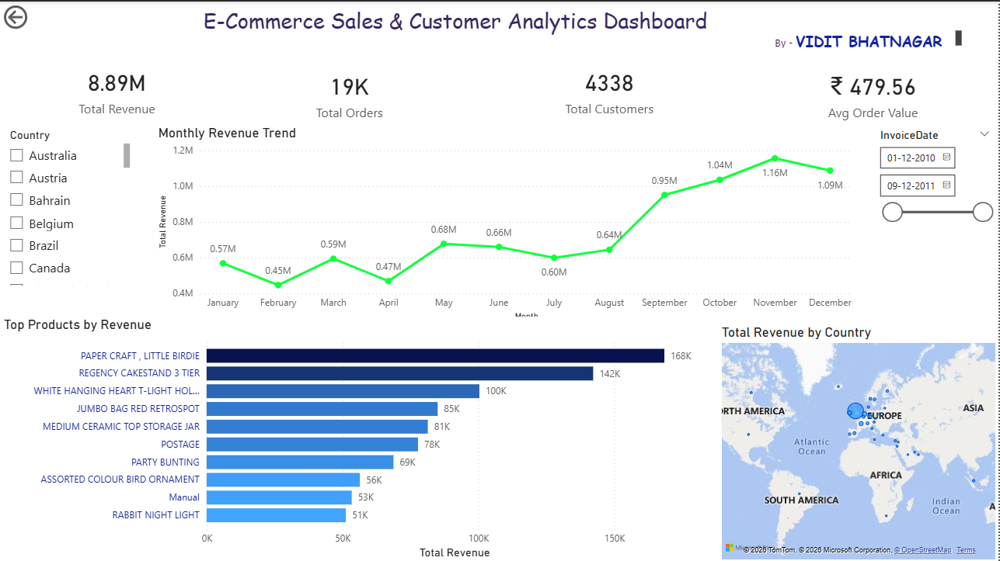

Ecommerce Sales and Customer Analytics Project

This project analyzes real world ecommerce transaction data to generate business insights and customer segmentation. The goal is to understand revenue trends, customer behavior, and product performance using Python, SQL, and Power BI.

Project Overview

This project follows a complete data analytics workflow
Data cleaning using Python
Customer segmentation using RFM analysis
Business insights using SQL queries
Interactive dashboard using Power BI

Dataset - Online retail dataset containing transactions, customers, products, and countries

Tools and Technologies Used - 
Python
Pandas
MySQL
Power BI

Key Insights 

Identified high value and low value customers using RFM analysis
Analyzed monthly revenue trends and sales growth
Found top performing products and countries
Detected customer segments such as VIP, Loyal, At Risk, and Lost

Project Structure

Data folder contains raw and processed datasets
Python folder contains data cleaning and RFM scripts
Sql folder contains analysis queries
Dashboard folder contains Power BI file and screenshots

Author
Vidit Bhatnagar
